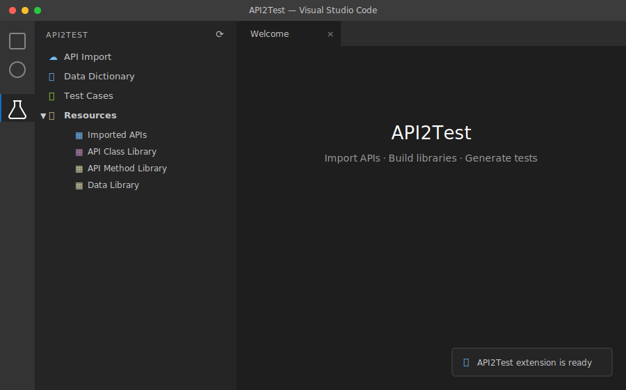
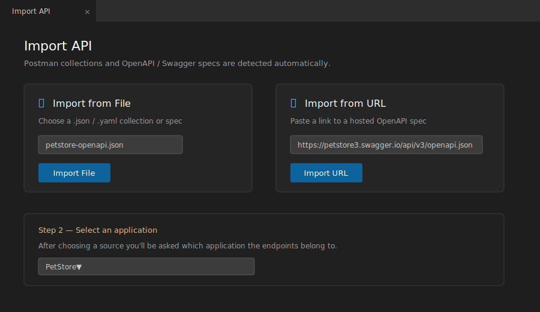
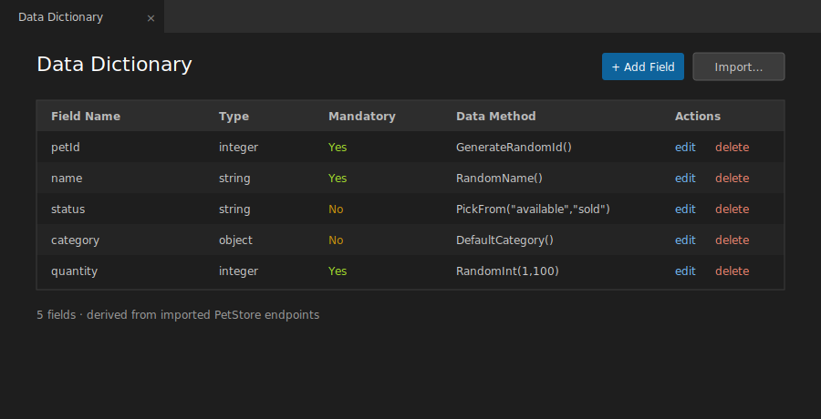
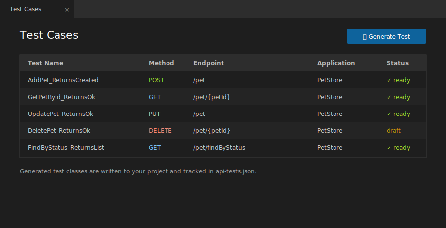

# API2Test for VS Code — Quick Start

API2Test imports your API definitions (Postman collections or OpenAPI/Swagger specs),
organizes them into reusable libraries, and helps you generate API test classes — all
inside VS Code.

This guide gets you from install to your first generated test in a few minutes.

> The figures below illustrate the API2Test UI. Your colours will match your active
> VS Code theme.

---

## 1. Install

**From the bundled package**

This repo ships the extension as [`Api2Test.vsix`](Api2Test.vsix).

```bash
code --install-extension Api2Test.vsix
```

Or in VS Code: open the Extensions view (`Ctrl+Shift+X`) → `…` menu →
**Install from VSIX…** → pick `Api2Test.vsix`.

See [`InstallationGuide.pdf`](InstallationGuide.pdf) for step-by-step install
instructions with prerequisites.

**For development (from source)**

```bash
npm install
npm run compile
# then press F5 in VS Code to launch the Extension Development Host
```

When the extension activates you'll see the message **"API2Test extension is ready"**.

---

## 2. Open the API2Test panel

Click the **flask icon** (🧪) in the Activity Bar on the left edge of VS Code.
The **API2Test** tree view opens with four entries.



| Entry | What it does |
|-------|--------------|
| **API Import** | Import a Postman collection or OpenAPI/Swagger spec |
| **Data Dictionary** | Define and manage field-level test data |
| **Test Cases** | View and generate API test cases |
| **Resources** | Imported APIs, API Class Library, API Method Library, Data Library |

> Tip: use the **Refresh** button (top of the panel) any time the tree looks stale.

---

## 3. Import an API

Click **API Import**. The import dialog opens with two options:

- **From File** — choose a `.json` Postman collection or an OpenAPI/Swagger
  (`.json` / `.yaml`) file.
- **From URL** — paste a link to a hosted OpenAPI/Swagger spec.



The format is detected automatically. You'll be prompted to pick (or name) the
**application** the endpoints belong to, then the endpoints are imported into your
library.

Try it with the samples in [`Example Swagger Files`](Example%20Swagger%20Files) —
e.g. `petstore-openapi.json` or the Postman collections included there.

**Or import straight from a public URL.** Pick **From URL** and paste one of these
live, free specs (no API key needed):

| API | Spec URL |
|-----|----------|
| Swagger PetStore (OpenAPI 3.0) | `https://petstore3.swagger.io/api/v3/openapi.json` |
| Swagger PetStore (Swagger 2.0) | `https://petstore.swagger.io/v2/swagger.json` |
| APIs.guru Directory (OpenAPI 3.0) | `https://api.apis.guru/v2/specs/apis.guru/2.2.0/openapi.json` |

Verify the result under **Resources → Imported APIs**, which shows every imported
endpoint in a table.

---

## 4. Review your libraries (Resources)

Expand **Resources** to find:

- **Imported APIs** — every endpoint you've imported, in a table view.
- **API Class Library** — the API client classes available for generation.
- **API Method Library** — individual API methods (add / edit / delete).
- **Data Library** — reusable data-generation methods (add / edit / delete).

These are the building blocks the generators draw on.

---

## 5. Set up your Data Dictionary (optional but recommended)

Click **Data Dictionary** to open its table page. Here you define the fields your
tests use — name, type, whether they're mandatory, and which **data method**
supplies their value.



To bootstrap it quickly, use **Import Data Dictionary from API Endpoints** (the
download icon on the Data Dictionary section) to derive fields directly from the
endpoints you imported.

---

## 6. Generate a test

Click **Test Cases** to open the Test Cases page, then use the toolbar to
**Generate Test**. You can also right-click an endpoint to **Generate Class** for
that specific API method.



The generators combine your imported endpoints, class/method libraries, and data
dictionary into ready-to-use API test classes. A complete worked output is in
[`Example Generated Project`](Example%20Generated%20Project).

---

## Where your data lives

All API2Test data is stored as JSON on your machine at:

```
~/.vscode/API2Test/data/
```

(on Windows: `C:\Users\<you>\.vscode\API2Test\data\`)

Files include `applications.json`, `api-methods.json`, `api-method-library.json`,
`api-class-library.json`, `data-dictionary.json`, `data-library.json`,
`generated-classes.json`, and `api-tests.json`. They're created automatically on
first run and never overwritten, so your edits are safe across updates.

---

## Typical workflow at a glance

```
API Import  →  Resources (review)  →  Data Dictionary  →  Test Cases (generate)
```

1. **Import** your Postman collection or OpenAPI spec.
2. **Review** the endpoints and libraries under Resources.
3. **Define** test data in the Data Dictionary.
4. **Generate** test classes from the Test Cases page.

---

## What's in this repo

| Item | Description |
|------|-------------|
| [`Api2Test.vsix`](Api2Test.vsix) | The installable VS Code extension |
| [`InstallationGuide.pdf`](InstallationGuide.pdf) | Install steps and prerequisites |
| [`QuickStartGuide.pdf`](QuickStartGuide.pdf) | This guide, as a printable PDF |
| [`Example Swagger Files`](Example%20Swagger%20Files) | Sample specs/collections to import |
| [`Example Generated Project`](Example%20Generated%20Project) | A worked test project |
| [`Feedback Questionnaire.pdf`](Feedback%20Questionnaire.pdf) | Tell us how the trial went |

---

## Troubleshooting

- **Tree is empty after import** — click **Refresh** at the top of the panel.
- **Import from URL fails** — make sure the URL returns the raw spec (JSON/YAML),
  not an HTML page; API2Test rejects responses that start with `<html>`.
- **Extension didn't activate** — check **Output → API2Test** (or the Developer
  Console, `Help → Toggle Developer Tools`) for the activation log.

---

When you've finished trying API2Test, we'd love your feedback —
please fill in [`Feedback Questionnaire.pdf`](Feedback%20Questionnaire.pdf).
